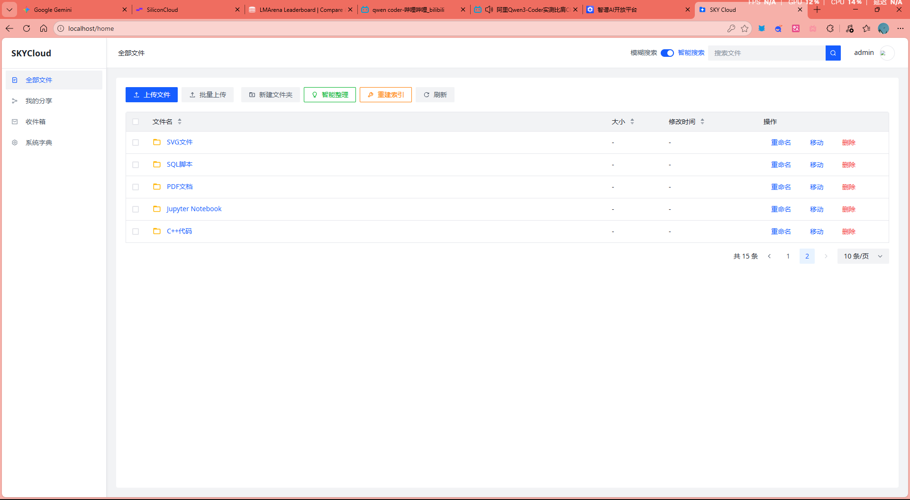
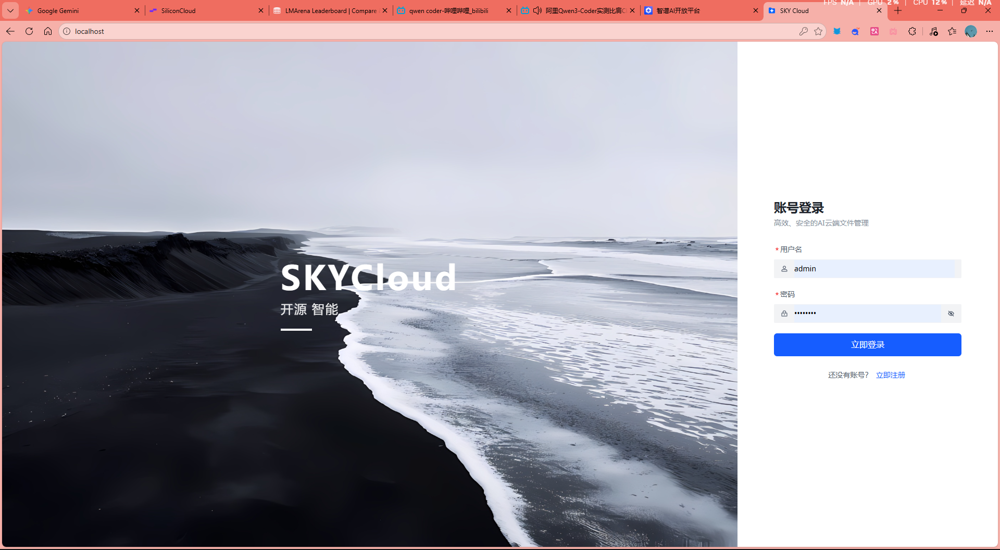
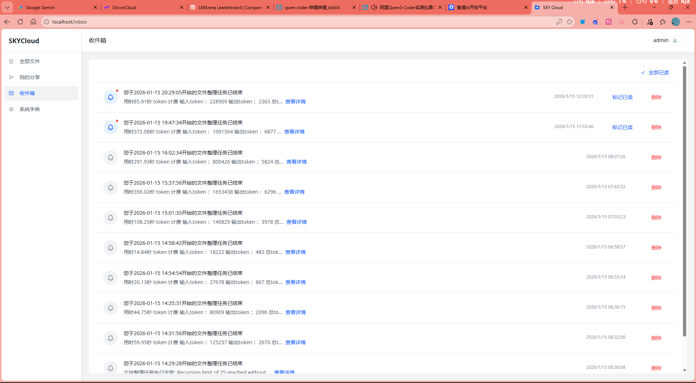

<div align="center">
  <h1 style="letter-spacing:4px;">SKYCLOUD</h1>
  <p><strong>AI 驱动的云文件管理平台</strong></p>
  <p>
    
    
    
    
    
    
  </p>
  <p><a href="./README_EN.md">English README</a></p>
</div>

# SKYCloud

SKYCloud 是一个 AI 增强的云文件管理系统，支持：
- 文件上传、预览
- 分享链接与收件箱协作
- 基于 LangChain/OpenAI 增强RAG 的智能对话
- 基于 LangGraph的文件智能分类整理

## 功能截图

| 登录 / 控制台 | 文件浏览 |
| --- | --- |
|  |  |

| 智能助手 |
| --- |
|  |

## 技术栈

- 后端：FastAPI、SQLAlchemy、Redis、PostgreSQL (pgvector)
- 前端：Vue 3、TypeScript、Vite、Arco Design
- Worker：Python 多线程任务进程（异步索引/整理）
- 部署：Docker Compose

## 项目结构

```text
SKYCloud/
|- backend/                # FastAPI 应用 + worker
|  |- app/                 # 路由、模型、服务、Schemas
|  |- worker/              # 后台任务处理
|  |- run.py               # FastAPI 入口
|  |- tasks.py             # Worker 入口
|  `- requirements.txt
|- frontend/               # Vue 3 + Vite 应用
|  |- src/
|  `- package.json
|- images/                 # README 图片
|- docker-compose.yml
`- .env.example
```

## 环境要求

- Python 3.10+
- Node.js 20+
- Docker + Docker Compose（可选，推荐一键启动）

## 快速开始 (Docker)

1. 克隆并进入项目：

```bash
git clone https://github.com/TianyaSKY/SKYCloud
cd SKYCloud
```

2. 创建环境变量文件：

```bash
cp .env.example .env
```

3. 修改 `.env` 关键配置：

## RAG 说明

当前 RAG 是“文件级描述检索 + 多查询融合”，核心流程如下：

1. 文件索引（离线）
- 文件上传后由 `backend/tasks.py` worker 异步处理。
- 为文件生成描述并写入 `files.description`，再生成 embedding 写入 `files.vector_info`（1024 维 pgvector）。
- 依赖 `files` 表上的向量索引。

2. 关键词重写（在线）
- 聊天接口 `/api/chat` 收到问题后，先让 LLM 输出 6 维结构化关键词：
  - `topic_terms`（主题词）
  - `entity_terms`（实体词）
  - `time_terms`（时间词）
  - `file_type_terms`（文件类型词）
  - `action_terms`（动作词）
  - `synonym_terms`（同义扩展词）

3. Multi-Query Fusion 检索
- 基于“原问题 + 多维关键词”生成多条 query（上限由 `RAG_MULTI_QUERY_MAX_QUERIES` 控制）。
- 每条 query 分别执行向量召回（每路 top-k 为 `RAG_VECTOR_FETCH_K`）。
- 多路召回结果通过 RRF 融合排序（参数 `RAG_RRF_K`），再截断到 `RAG_FUSION_TOP_K`。
- 融合结果可选经过 rerank 模型重排（`RERANK_*` 配置），然后作为上下文给回答模型。

4. 生成与流式返回
- 最终回答按 SSE 流式返回，前端会接收：
  - `keywords`：结构化关键词展示
  - `status`：检索/错误状态
  - `token`：回答增量 token

5. 启动全部服务：

```bash
docker-compose up -d --build
```

6. 访问地址：
- 前端：`http://localhost:${FRONTEND_PORT}`（默认 `http://localhost:80`）
- 后端健康检查：`http://localhost:${BACKEND_API_PORT}/api/health`（默认 `http://localhost:5000/api/health`）


## 默认账号

`backend/init_db.sql` 内包含默认管理员初始化数据：
- 用户名：`admin`
- 密码：`admin123`

为安全起见，非演示环境请首次登录后立即修改。