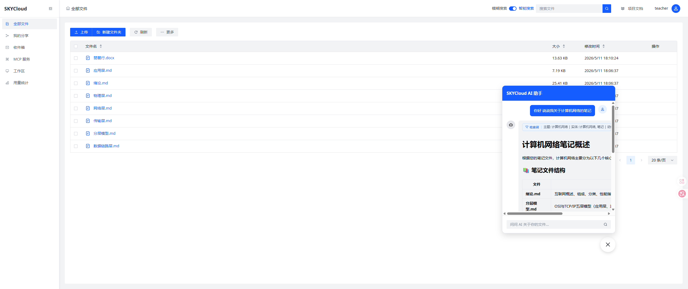
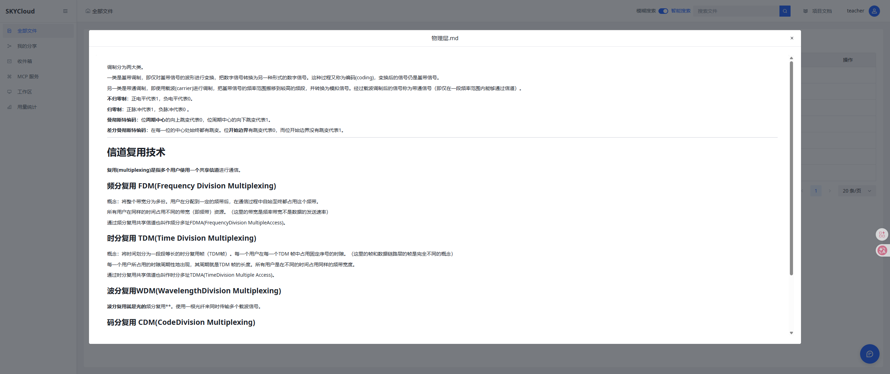
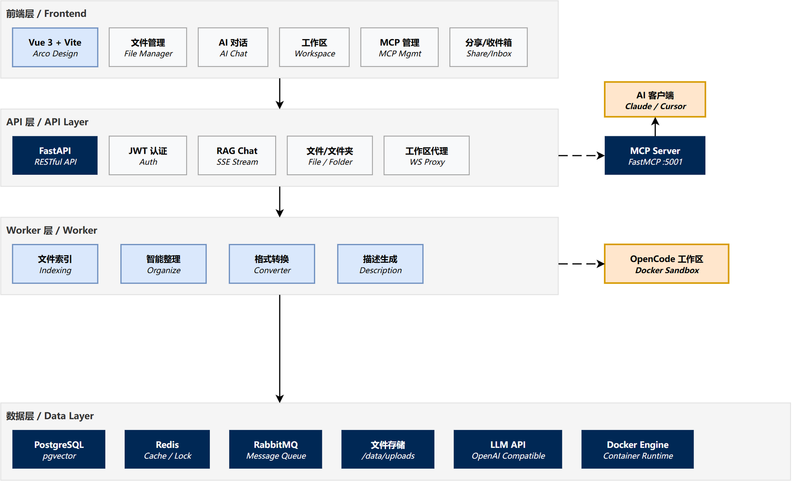
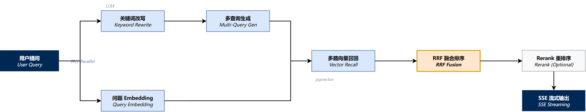
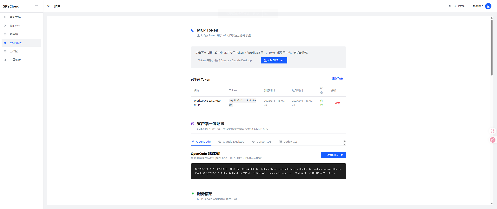
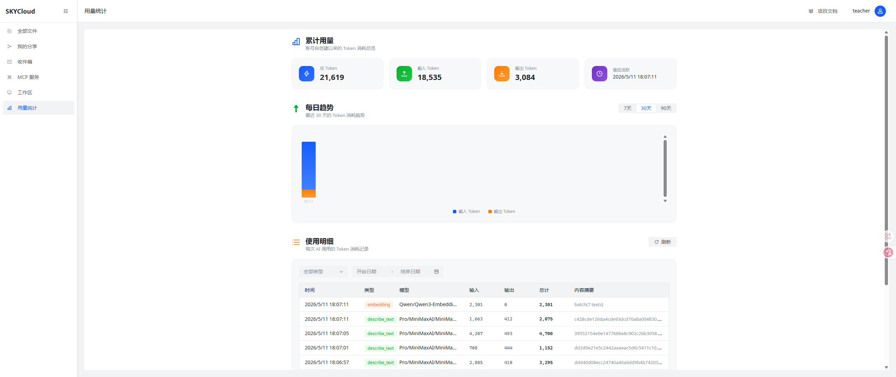
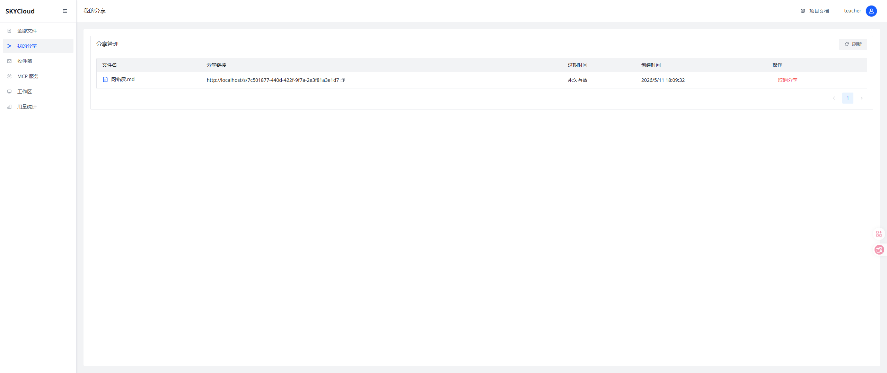
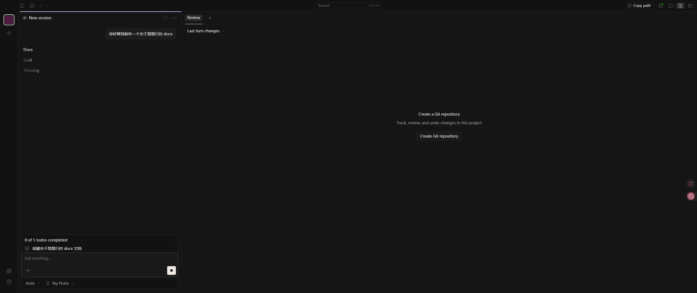

<div align="center">
  <h1>SKYCLOUD</h1>
  <p><strong>AI 驱动的云文件管理平台</strong></p>
  <p>
    
    
    
    
    
    
  </p>
  <p><a href="./README_EN.md">English</a></p>
</div>

---

SKYCloud 是一个 AI 增强的云文件管理系统，提供从文件存储、智能检索到自主执行的一站式体验。

## 功能亮点

- **文件管理** — 上传（分片 / 秒传）、下载、预览、批量操作、文件夹树、格式转换
- **AI 对话（RAG）** — 多维关键词改写 → Multi-Query 向量召回 → RRF 融合 → 可选 Rerank → SSE 流式输出，支持图片引用
- **AI 文件整理** — LangGraph ReAct Agent 自动分类，增量 / 全量模式，整理后收件箱通知
- **全能工作区** — 独立 Docker 沙箱 + MCP 协议，AI Agent 可读写云盘、运行代码、自动化任务（Manus 风格）
- **MCP 服务** — 17 个工具 / 4 个 Prompt / 2 个 Resource，Claude Desktop、Cursor 等客户端直接接入
- **分享 & 收件箱** — 带过期时间的分享链接、系统通知推送
- **Token 用量追踪** — 对话 / 索引 / 整理的消耗统计，含管理员汇总视图
- **性能优化** — Bloom Filter 权限前置、Redis 缓存、RabbitMQ 异步索引、并行 Embedding

| 智能助手对话                           | 文件预览                             |
|----------------------------------|----------------------------------|
|  |  |

## 架构



| 层级      | 技术                                                   |
|---------|------------------------------------------------------|
| 后端      | FastAPI · SQLAlchemy · Pydantic                      |
| AI      | LangChain · LangGraph · OpenAI API（兼容 SiliconFlow 等） |
| 向量库     | PostgreSQL 15 + pgvector（1024 维）                     |
| 队列 / 缓存 | RabbitMQ 3.13 · Redis 7                              |
| 前端      | Vue 3 · TypeScript · Vite · Arco Design              |
| MCP     | FastMCP（Streamable HTTP）                             |
| 部署      | Docker Compose                                       |

## 快速开始

> 环境要求：Docker + Docker Compose

```bash
git clone https://github.com/TianyaSKY/SKYCloud && cd SKYCloud
cp .env.example .env
# 编辑 .env，至少填写 Chat 和 Embedding 模型的 API_URL / API_KEY / MODEL
docker-compose up -d --build
```

启动后访问 `http://localhost`（默认端口 80），默认管理员 `admin / admin123`。

> 非演示环境请首次登录后立即修改密码。`SECRET_KEY` 未设置时会使用不安全的默认值，生产环境务必配置。

### 停止服务（含 OpenCode 工作区）

OpenCode 工作区是后端动态 `docker run` 创建的，**不在** `docker-compose.yml` 中，单独执行 `docker compose down` 不会停掉它们。

请使用仓库脚本一并清理：

```powershell
# Windows PowerShell
.\scripts\compose-down.ps1
# 如需同时删除数据卷
.\scripts\compose-down.ps1 -v
```

```bash
# Linux / macOS / Git Bash
chmod +x scripts/compose-down.sh   # 仅首次
./scripts/compose-down.sh
./scripts/compose-down.sh -v
```

临时手动清理也可：

```bash
docker rm -f $(docker ps -aq --filter label=skycloud.component=workspace) 2>/dev/null
docker rm -f $(docker ps -aq --filter name=skycloud-workspace-) 2>/dev/null
docker compose down
```

## RAG 检索增强



**离线**：文件上传 → RabbitMQ → Worker 生成描述 + 1024 维 Embedding → pgvector

**在线**：6 维关键词改写 → 多查询生成 → 并行向量召回 → RRF 融合 → Rerank → SSE 流式输出

## MCP 接入

MCP Server 独立容器运行，默认端口 **5001**。每个用户自动签发**唯一** MCP Token：登录后点击右上角头像 → **MCP Token**
即可复制或刷新。工作区在创建/启动/重启时会自动注入该 Token，无需手动「连接 MCP」。

| 工作区 / MCP              | Token 用量                            |
|------------------------|-------------------------------------|
|  |  |

## 全能工作区

每个工作区运行在独立 Docker 容器中，通过 MCP 协议让 AI 在沙箱内自主执行任务并与云盘交互。

| 分享管理                    | 工作区                          |
|-------------------------|------------------------------|
|  |  |

## 本地开发

```bash
# 后端（需 PostgreSQL / Redis / RabbitMQ）
cd backend && pip install -r requirements.txt
python run.py          # API
python tasks.py        # Worker
python mcp_run.py      # MCP Server

# 前端（Vite dev proxy → localhost:5000）
cd frontend && npm ci && npm run dev
```

## 项目结构

```
SKYCloud/
├── backend/
│   ├── app/
│   │   ├── api/            # HTTP：routers / schemas / dependencies / factory
│   │   ├── mcp/            # MCP 协议适配（tools / resources）
│   │   ├── workers/        # 异步任务：索引 / 整理 / 格式转换
│   │   ├── services/       # 共享业务逻辑（API / MCP / Worker 共用）
│   │   ├── models/         # SQLAlchemy 模型
│   │   ├── infra/          # 缓存 / 队列 / 上传 / 时间工具
│   │   ├── extensions.py   # DB / Redis 等基础设施
│   │   └── exceptions.py   # 统一异常
│   ├── run.py              # API 入口
│   ├── tasks.py            # Worker 入口
│   └── mcp_run.py          # MCP 入口
├── frontend/src/
│   ├── api/                # Axios 封装
│   ├── components/         # 通用组件
│   ├── views/              # 页面
│   ├── hooks/              # Composition API
│   └── router/             # 路由
├── docker-compose.yml
└── .env.example
```

## License

MIT
