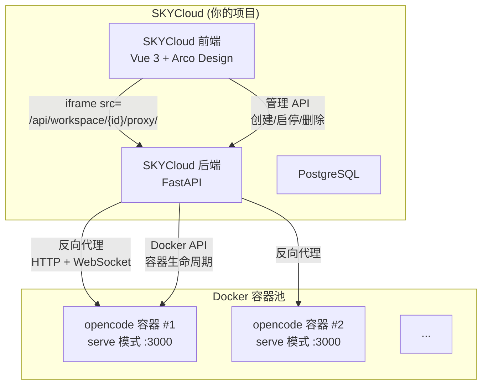
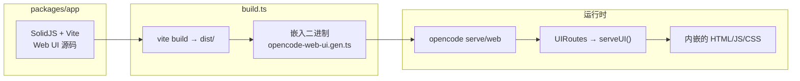
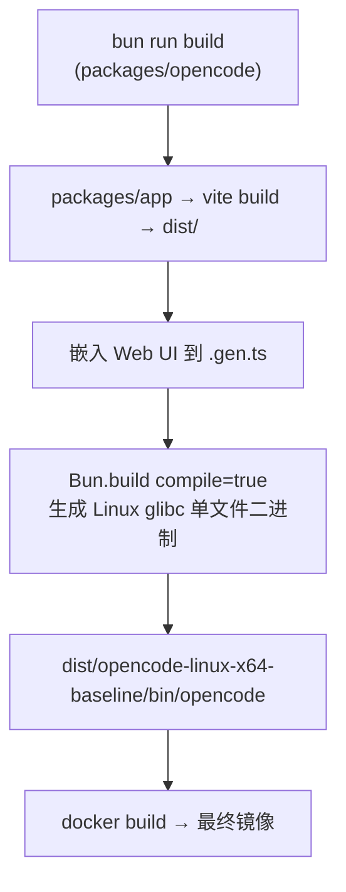

# SKYCloud × OpenCode 集成方案（修订版 v2）

> **已确认决策**：
> - ✅ iframe 嵌入 opencode Web UI
> - ✅ 基于当前 opencode 项目（含自定义修改）构建 Docker 镜像
> - ✅ SKYCloud 后端做反向代理（不直接暴露容器端口）
> - ✅ 不需要修改 opencode 源码（反向代理方案下 CSP/CORS/Auth 问题自动消除）

---

## 1. 整体架构



核心思路极其简单：
1. **SKYCloud 后端**管理 Docker 容器生命周期
2. **SKYCloud 后端**做反向代理（帮忙转发），把浏览器的请求转发到容器内部
3. **SKYCloud 前端**用 iframe 嵌入 opencode 的 Web UI

> **什么是反向代理？** 就是你的 FastAPI 后端当中间人。浏览器请求 `/api/workspace/123/proxy/xxx`，后端收到后转发到容器内部的 `http://容器IP:3000/xxx`，再把结果返回给浏览器。浏览器全程不知道 opencode 容器的存在，以为所有数据都来自 SKYCloud 自己。这样就不存在跨域问题。

---

## 2. opencode 的 Web UI 架构分析

通过代码分析，opencode 的 Web UI 是这样工作的：



### 关键文件

| 文件 | 作用 |
|------|------|
| [packages/app/](file:///e:/Projects/opencode/packages/app) | **Web UI 源码** — SolidJS + Vite + TailwindCSS |
| [script/build.ts](file:///e:/Projects/opencode/packages/opencode/script/build.ts#L57-L79) | 构建时把 `packages/app/dist/` 内嵌到二进制（`opencode-web-ui.gen.ts`） |
| [server/routes/ui.ts](file:///e:/Projects/opencode/packages/opencode/src/server/routes/ui.ts) | 运行时从嵌入资源提供 Web UI，未嵌入时代理到 `app.opencode.ai` |
| [Dockerfile](file:///e:/Projects/opencode/packages/opencode/Dockerfile) | 官方 Docker 镜像：Alpine + musl 二进制 |
| [cli/cmd/web.ts](file:///e:/Projects/opencode/packages/opencode/src/cli/cmd/web.ts) | `opencode web` 命令 — 启动服务器 + 打开浏览器 |
| [cli/cmd/serve.ts](file:///e:/Projects/opencode/packages/opencode/src/cli/cmd/serve.ts) | `opencode serve` 命令 — 纯 headless API 服务器 |

### Web UI 模式

构建时会把 Web UI 的 HTML/JS/CSS 直接嵌入到 opencode 二进制中，运行时不需要任何外部依赖。

> [!NOTE]
> 构建时不要加 `--skip-embed-web-ui` 参数，否则 Web UI 不会被嵌入。

---

## 3. 为什么不需要修改 opencode 源码

如果直接把容器端口暴露给浏览器，会遇到 CSP、CORS、Auth 三个跨域问题。但我们采用 **反向代理方案**，所以这些问题都不存在：

| 潜在阻碍 | 直接暴露端口 | 反向代理方案 |
|----------|-------------|-------------|
| **CSP frame-ancestors** — opencode 的 CSP 不允许被其他域名 iframe 嵌入 | ❌ 需要改 ui.ts | ✅ 不存在（同源） |
| **CORS 白名单** — opencode 只允许 localhost/opencode.ai | ❌ 需要 `--cors` 参数 | ✅ 不存在（同源） |
| **Basic Auth** — iframe 无法传递用户名密码 | ❌ 需要 auth_token 或改代码 | ✅ 代理层注入 Auth 头 |

> [!TIP]
> 反向代理 = 浏览器只跟 SKYCloud 后端通信，SKYCloud 后端再转发到 opencode 容器。对浏览器来说，一切都是同一个域名，所以跨域问题根本不存在。

---

## 4. Docker 镜像构建方案

### 4.1 构建流程



### 4.2 推荐：全自包含的多阶段 Dockerfile

为了避免在 Windows 上交叉编译的问题，用一个**多阶段 Dockerfile** 完全在容器内构建：

```dockerfile
# ========== Stage 1: 构建 ==========
FROM oven/bun:latest AS builder

# node-gyp 编译原生模块（tree-sitter 等）需要 python3/make/g++
RUN apt-get update && apt-get install -y python3 make g++ && rm -rf /var/lib/apt/lists/*

WORKDIR /src
COPY . .

RUN bun install
# OPENCODE_CHANNEL 跳过 git 分支检测（.git 被 .dockerignore 排除了）
# OPENCODE_VERSION 跳过从 npm 获取版本号
RUN cd packages/opencode && OPENCODE_CHANNEL=latest OPENCODE_VERSION=0.0.1 bun run build

# ========== Stage 2: 运行时 ==========
# 用 Debian 而不是 Alpine，因为 node-pty（终端功能）需要 glibc
FROM debian:bookworm-slim

RUN apt-get update && apt-get install -y --no-install-recommends \
    ripgrep git ca-certificates \
    && rm -rf /var/lib/apt/lists/*

# Debian 用 glibc，所以要用 baseline（glibc）二进制而不是 musl
COPY --from=builder /src/packages/opencode/dist/opencode-linux-x64-baseline/bin/opencode \
     /usr/local/bin/opencode

RUN opencode --version

VOLUME /workspace
WORKDIR /workspace

EXPOSE 3000

ENTRYPOINT ["opencode"]
CMD ["serve", "--hostname", "0.0.0.0", "--port", "3000"]
```

> [!WARNING]
> **为什么用 Debian 而不是 Alpine？** opencode 的终端功能依赖 `node-pty`，它的原生 .so 文件需要 glibc。
> Alpine 用的是 musl，即使加了 `gcompat` 兼容层也不行（缺少 `gnu_get_libc_version` 等符号）。
> Debian slim 镜像约 80MB，比 Alpine 大一些但功能完整。

> [!NOTE]
> **为什么不能用 `--single`？** `bun run build --single` 只构建当前平台的特定变体，会跳过 musl 和 baseline 变体。
> 必须用 `bun run build`（不加 `--single`）来构建包含 baseline 的全平台二进制。

> [!NOTE]
> 这个 Dockerfile 放在 opencode 项目根目录（[Dockerfile.skycloud](file:///e:/Projects/opencode/Dockerfile.skycloud)）。
> 同时需要 [.dockerignore](file:///e:/Projects/opencode/.dockerignore) 排除 `.git`、`node_modules`、`**/dist` 等目录以加速构建。

---

## 5. SKYCloud 侧需要做的事

### 5.1 后端（FastAPI）

```python
# 新增工作区管理路由
POST   /api/workspace              # 创建工作区（docker run）
GET    /api/workspace              # 列出用户工作区
GET    /api/workspace/{id}         # 获取工作区状态
POST   /api/workspace/{id}/start   # 启动容器
POST   /api/workspace/{id}/stop    # 停止容器  
DELETE /api/workspace/{id}         # 删除容器+卷

# 反向代理路由（HTTP + WebSocket 都要代理）
ANY    /api/workspace/{id}/proxy/{path:path}  # HTTP 代理
WS     /api/workspace/{id}/proxy/{path:path}  # WebSocket 代理（同路径，自动 upgrade）
```

### 5.2 反向代理实现要点

反向代理需要同时代理 **HTTP 请求** 和 **WebSocket 连接**。opencode Web UI 依赖以下 WebSocket 端点获取实时事件：

| 端点 | 作用 |
|------|------|
| `/event` | 全局事件流（session 变更等） |
| `/global/event` | 全局事件 |
| `/session/{id}/message` | 会话消息 |
| `/session/{id}/prompt_async` | 异步 prompt |

FastAPI 反向代理示例（HTTP + WebSocket）：

```python
import httpx
from fastapi import WebSocket
from starlette.requests import Request
from starlette.responses import StreamingResponse

async def proxy_http(request: Request, container_url: str, password: str):
    """反向代理 HTTP 请求，自动注入认证头"""
    async with httpx.AsyncClient() as client:
        # 在代理层注入 Basic Auth，浏览器无感
        headers = dict(request.headers)
        headers["authorization"] = f"Basic {base64.b64encode(f'opencode:{password}'.encode()).decode()}"
        headers["host"] = container_url.split("//")[1]
        
        response = await client.request(
            method=request.method,
            url=f"{container_url}{request.url.path}",
            headers=headers,
            content=await request.body(),
            params=request.query_params,
        )
        return StreamingResponse(
            content=response.iter_bytes(),
            status_code=response.status_code,
            headers=dict(response.headers),
        )

async def proxy_websocket(ws: WebSocket, container_url: str, password: str):
    """反向代理 WebSocket 连接"""
    import websockets
    await ws.accept()
    
    # 连接到容器内的 opencode WebSocket
    container_ws_url = container_url.replace("http://", "ws://")
    headers = {"authorization": f"Basic {base64.b64encode(f'opencode:{password}'.encode()).decode()}"}
    
    async with websockets.connect(f"{container_ws_url}{ws.url.path}", extra_headers=headers) as upstream:
        # 双向转发
        async def forward_to_upstream():
            async for message in ws.iter_text():
                await upstream.send(message)
        
        async def forward_to_client():
            async for message in upstream:
                await ws.send_text(message)
        
        await asyncio.gather(forward_to_upstream(), forward_to_client())
```

> [!IMPORTANT]
> 认证在代理层注入 `Authorization` header，不要在 iframe URL 里用 `auth_token` query 参数——query 参数会出现在浏览器历史和日志中，不安全。

### 5.3 前端（Vue 3）

```vue
<!-- WorkspaceDetail.vue -->
<template>
  <div class="workspace-container">
    <div class="workspace-header">
      <h2>{{ workspace.name }}</h2>
      <WorkspaceControls :workspace="workspace" />
    </div>
    
    <!-- 核心：iframe 嵌入 opencode Web UI -->
    <!-- 通过反向代理访问，完全同源，无需 auth_token -->
    <iframe
      v-if="workspace.status === 'running'"
      :src="`/api/workspace/${workspace.id}/proxy/`"
      class="opencode-iframe"
      allow="clipboard-write"
    />
  </div>
</template>

<style>
.opencode-iframe {
  width: 100%;
  height: calc(100vh - 64px);
  border: none;
}
</style>
```

> [!TIP]
> iframe 的 src 是 SKYCloud 自己的路径 `/api/workspace/{id}/proxy/`，浏览器看到的全是同域名请求，不存在跨域问题。
> 认证由后端反向代理自动注入，前端完全不用关心密码。

---

## 6. 反向代理方案对比

| 方案 | 优点 | 缺点 |
|------|------|------|
| **A: SKYCloud 后端代理**<br/>FastAPI httpx + websockets | 全在你控制内，安全 | 需要手写 WS 双向代理 |
| **B: Nginx 反向代理** | 成熟稳定，性能好 | 需要动态更新 nginx.conf |
| **C: Traefik** | 自动发现 Docker 容器 | 引入新依赖 |

推荐 **方案 A** 起步（简单直接），后期流量大了考虑 B/C。

---

## 7. docker-compose 集成方式

```yaml
# SKYCloud 的 docker-compose.yml 修改
services:
  # ... 保留现有的 db, redis, rabbitmq, frontend 等

  backend-api:
    build:
      context: ./backend
      dockerfile: Dockerfile
    volumes:
      - ${UPLOAD_HOST_PATH}:/data/uploads
      - /var/run/docker.sock:/var/run/docker.sock   # ← 新增！
    environment:
      # ... 原有环境变量
      - OPENCODE_IMAGE=skycloud/opencode-workspace:latest
      - SKYCLOUD_DOCKER_NETWORK=skycloud-network
    depends_on:
      db: { condition: service_healthy }
      redis: { condition: service_healthy }
      rabbitmq: { condition: service_healthy }
    networks:
      - skycloud-network

  # opencode 容器由后端通过 Docker API 动态创建，不在 compose 里静态定义
```

> [!CAUTION]
> 挂载 `/var/run/docker.sock` 意味着 backend-api 容器有宿主机的 Docker 控制权。生产环境应考虑：
> - 用 [Docker Socket Proxy](https://github.com/Tecnativa/docker-socket-proxy) 限制权限
> - 或用 Docker API over TCP + TLS

---

## 8. 实施步骤清单

### 第一步：构建 opencode Docker 镜像 ✅ 已完成

镜像 `skycloud/opencode-workspace:latest` 已构建并验证通过。

构建命令：
```bash
cd e:\Projects\opencode
docker build -f Dockerfile.skycloud -t skycloud/opencode-workspace:latest .
```

验证结果：

| 功能 | 状态 | 说明 |
|------|------|------|
| Web UI 加载 | ✅ | SKYCloud 品牌、中文界面正常 |
| 创建 Git 仓库 | ✅ | 点击按钮后成功创建，显示 master 分支 |
| 聊天输入框 | ✅ | 可以输入文字 |
| 终端 (PTY) | ✅ | shell 提示符正常，可执行命令 |
| 文件浏览 | ✅ | 正常显示 |

### 第二步：SKYCloud 后端 — 容器管理 ✅ 已完成

1. ✅ 安装 Docker SDK：`pip install docker`（已加入 requirements.txt）
2. ✅ 实现工作区 CRUD API（创建/列出/启停/删除容器）
3. ✅ 数据库表存储工作区信息（容器 ID、密码、状态等）

### 第三步：SKYCloud 后端 — 反向代理 ✅ 已完成

1. ✅ 安装依赖：`pip install httpx websockets`（已加入 requirements.txt）
2. ✅ 实现 HTTP 反向代理（自动注入 Auth header）
3. ✅ 实现 WebSocket 反向代理（双向转发）

### 第四步：SKYCloud 前端 — iframe 嵌入 ✅ 已完成

1. ✅ 创建工作区管理页面（WorkspaceView.vue）
2. ✅ 用 iframe 嵌入 opencode Web UI
3. ✅ iframe src 指向反向代理路径 `/api/workspace/{id}/proxy/`

---

## 9. 容器资源建议

| 配置项 | 推荐值 | 说明 |
|--------|--------|------|
| 内存 | 512MB - 1GB | opencode 本身约 200-500MB，AI 推理是远程调用不占本地 |
| CPU | 0.5 - 1 核 | 主要用于解析代码和运行工具 |
| 磁盘 | 按需（Volume） | 用户项目代码大小决定 |
| 镜像策略 | 预构建 | 先 `docker build` 好镜像，所有工作区共用同一个镜像 |

---

## 10. 你的自定义修改现状

已确认的修改（不影响构建流程）：
- [index.ts L71](file:///e:/Projects/opencode/packages/opencode/src/index.ts#L71)：`.scriptName("skycloud")` ✅
- [serve.ts L10](file:///e:/Projects/opencode/packages/opencode/src/cli/cmd/serve.ts#L10)：`"starts a headless skycloud server"` ✅
- [web.ts L35](file:///e:/Projects/opencode/packages/opencode/src/cli/cmd/web.ts#L35)：`"start skycloud server and open web interface"` ✅
